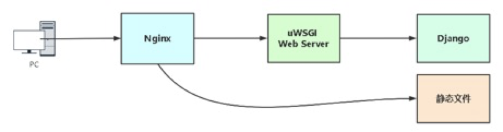
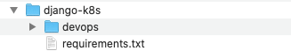
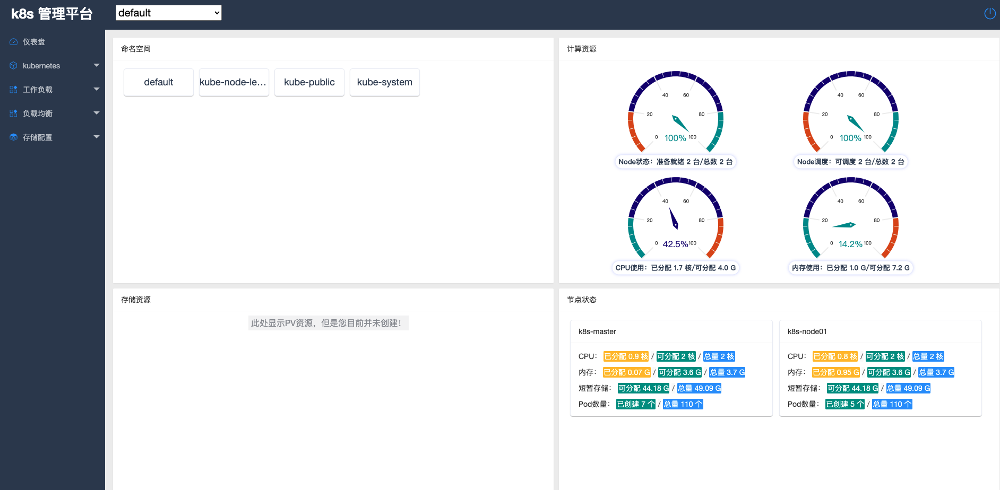
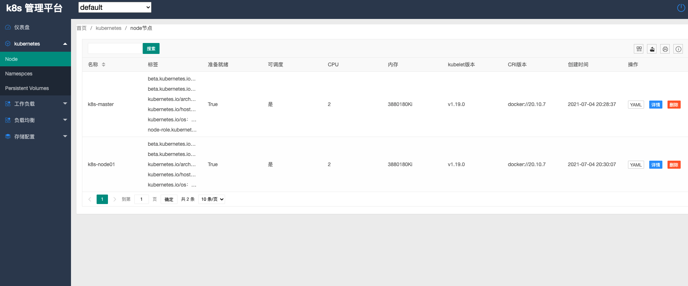
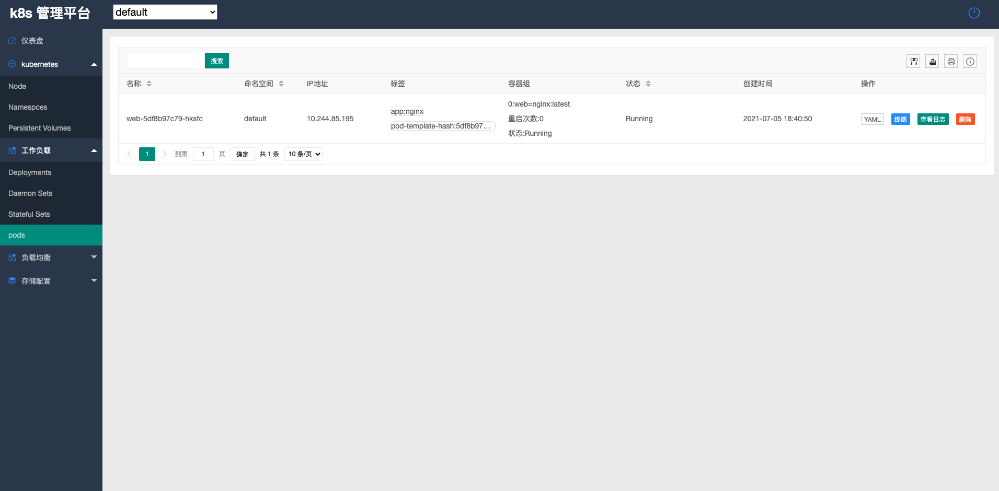

# >k8s-生产环境部署django项目


### 1. k8s-生产环境部署django项目

- 部署架构

  

  nginx 前端web服务，接收到动态请求通过uwsgi模块将请求转发给uwsgi服务器，uwsgi服务器通过django处理完后返回给Nginx，Nginx返回用户浏览器展示。

- **既然uwsgi是一个可以独立部署的服务器，为什么还用Nginx代理？**

  - Nginx作为入口可配置安全策略，并且可以为uwsgi提供负载均衡。
  - Nginx处理静态资源能力强

### 2. 将本地开发的项目打包

#### 2.1 导入依赖模块列表

```
 pip freeze > ~/requirements.txt
```

> 是用pip工具导出安装的pip list的显示的包

#### 2.2 修改数据库为mysql

```python
# devops_orm/settings.py
DATABASES = {
	'default': {
        'ENGINE': 'django.db.backends.mysql',
        'NAME': 'k8s',
        'USER': 'k8s',
        'PASSWORD': '12345678',
        'HOST': '192.168.0.78',
        'PORT': '3306',
	}
}
```

关闭debug模式和白名单

```python
# SECURITY WARNING: don't run with debug turned on in production!
DEBUG = False     # 关闭调试模式

# 开启用户访问IP
ALLOWED_HOSTS = ['*']     # 白名单，只允许列表中的ip访问，*代表所有
```

### 3. 服务器环境准备

#### 3.1 安装python3

- 安装依赖包

  ```
  yum -y install zlib-devel bzip2-devel openssl-devel ncurses-devel sqlite-devel readline-devel tk-devel gdbm-devel db4-devel libpcap-devel xz-devel libffi-devel
  ```

- 第一种方式用yum安装

  - Linux安装：

    ```shell
    yum install python36 -y
    ```

    >  一条命令完成安装。


#### 3.2 安装依赖模块列表

- 压缩本地代码和导出的模块依赖列表

  

  > 压缩为zip包，方便后面上传

  

  

- 上传压缩到服务器

  ```shell
  [root@k8s-master ~]# rz
  rz waiting to receive.
  Starting zmodem transfer.  Press Ctrl+C to cancel.
  Transferring k8s.zip...
    100%    1267 KB    1267 KB/sec    00:00:01       0 Errors  
  
  [root@k8s-master ~]# ll
  total 1272
  drwxr-xr-x 2 root root    4096 Jul  4 21:07 k8s-tools
  -rw-r--r-- 1 root root 1297880 Jul  4 21:04 k8s.zip
  ```

  > 这里通过rz命令上传的，可以使用sftp等

- 解压压缩包

  ```shell
  [root@k8s-master ~]# yum install unzip -y
  [root@k8s-master ~]# unzip k8s.zip
  [root@k8s-master ~]# ll
  total 1284
  drwxr-xr-x 3 root root    4096 Jul  5 14:28 devops
  drwxr-xr-x 2 root root    4096 Jul  4 21:07 k8s-tools
  -rw-r--r-- 1 root root 1297880 Jul  4 21:04 k8s.zip
  drwxr-xr-x 2 root root    4096 Jul  4 21:37 __MACOSX
  -rw-r--r-- 1 root root      58 Jul  4 21:46 requirements.txt
  [root@k8s-master ~]# mkdir -p /opt/k8s
  [root@k8s-master ~]# mv devops/* /opt/k8s/
  ```

- 安装依赖包

  ```
  [root@k8s-master ~]# pip3 install -r requirements.txt -i  http://mirrors.aliyun.com/pypi/simple --trusted-host mirrors.aliyun.com
  ```

  ```
  [root@k8s-master ~]# cat requirements.txt 
  Django
  kubernetes
  PyMySQL
  channels
  channels-redis
  PyYAML
  ```

#### 3.3 安装数据库

- mysql安装

  ```shell
  [root@k8s-master ~]# docker run -d --name db -p 3306:3306 -v mysqldata:/var/lib/mysql -e MYSQL_ROOT_PASSWORD=123456 mysql:5.7 --character-set-server=utf8
  [root@k8s-master ~]# docker exec  -it db bash
  root@f992b2375c5d:/# mysql -uroot -p$MYSQL_ROOT_PASSWORD 
  mysql: [Warning] Using a password on the command line interface can be insecure.
  Welcome to the MySQL monitor.  Commands end with ; or \g.
  Your MySQL connection id is 2
  Server version: 5.7.34 MySQL Community Server (GPL)
  
  Copyright (c) 2000, 2021, Oracle and/or its affiliates.
  
  Oracle is a registered trademark of Oracle Corporation and/or its
  affiliates. Other names may be trademarks of their respective
  owners.
  
  Type 'help;' or '\h' for help. Type '\c' to clear the current input statement.
  
  mysql> create database k8s;
  Query OK, 1 row affected (0.00 sec)
  ```

- 安装redis：

  ```shell
  [root@k8s-master ~]# docker run --name redis -d -p 6379:6379 redis:3
  ```

#### 3.4 启动开发环境

- 启动程序，验证依赖模块

  ```
  [root@k8s-master devops]# python3 manage.py runserver 0.0.0.0:8000
  Watching for file changes with StatReloader
  Performing system checks...
  
  System check identified no issues (0 silenced).
  
  You have 18 unapplied migration(s). Your project may not work properly until you apply the migrations for app(s): admin, auth, contenttypes, sessions.
  Run 'python manage.py migrate' to apply them.
  July 05, 2021 - 11:36:44
  Django version 3.2.5, using settings 'devops.settings'
  Starting ASGI/Channels version 3.0.3 development server at http://0.0.0.0:8000/
  ```

- 测试没有问题，同步数据库

  ```shell
  [root@k8s-master devops]# python3 manage.py migrate
  Operations to perform:
    Apply all migrations: admin, auth, contenttypes, sessions
  Running migrations:
    Applying contenttypes.0001_initial... OK
    Applying auth.0001_initial... OK
    Applying admin.0001_initial... OK
    Applying admin.0002_logentry_remove_auto_add... OK
    Applying admin.0003_logentry_add_action_flag_choices... OK
    Applying contenttypes.0002_remove_content_type_name... OK
    Applying auth.0002_alter_permission_name_max_length... OK
    Applying auth.0003_alter_user_email_max_length... OK
    Applying auth.0004_alter_user_username_opts... OK
    Applying auth.0005_alter_user_last_login_null... OK
    Applying auth.0006_require_contenttypes_0002... OK
    Applying auth.0007_alter_validators_add_error_messages... OK
    Applying auth.0008_alter_user_username_max_length... OK
    Applying auth.0009_alter_user_last_name_max_length... OK
    Applying auth.0010_alter_group_name_max_length... OK
    Applying auth.0011_update_proxy_permissions... OK
    Applying auth.0012_alter_user_first_name_max_length... OK
    Applying sessions.0001_initial... OK
  ```

#### 3.4  安装与配置uwsgi

- Centos7 服务器安装依赖包

  ```shell
  [root@k8s-master devops]# yum -y install gcc gcc-c++ gd cmake patch  automakemake autoconf libjpeg libjpeg-devel libpng libpng-devel freetype freetype-devellibxml2 libxml2-devel zlib zlib-devel glibc glibc-devel glib2 glib2-devel bzip2bzip2-devel ncurses ncurses-devel curl curl-devel e2fsprogs e2fsprogs-develkrb5 krb5-devel libidn libtools-libs libidn-devel openssl openssl-developenldap openldap-devel nss_ldap openldap-clients openldap-servers pcre-devel libmcrypt-devel readline-devellibcap-devel ntpdate vim tree wget python3-devel.x86_64
  ```

- uWSGI是一个[Web服务器](https://baike.baidu.com/item/Web服务器/8390210)，也是Python的一个模块，直接pip安装即可：

  ```shell
  [root@k8s-master devops]# pip3 install uwsgi -i http://mirrors.aliyun.com/pypi/simple --trusted-host mirrors.aliyun.com
  ```

- 创建uwsgi配置文件，路径任意，

  ```shell
  [root@k8s-master ~]# mkdir -p /opt/uwsgi
  [root@k8s-master ~]# cd /opt/uwsgi
  [root@k8s-master uwsgi]# vim uwsgi.ini 
  [root@k8s-master uwsgi]# cat uwsgi.ini 
  [uwsgi]
  # 项目目录
  chdir = /opt/k8s
  
  # 指定sock的文件路径
  socket = /opt/k8s/uwsgi.sock
  # 指定监听端口
  http = 0.0.0.0:8080
  
  # 静态资源
  static-map = /static=/opt/k8s/static
  
  # wsgi文件（django入口）
  wsgi-file=devops/wsgi.py
  
  # 进程个数
  processes = 1
  
  # 指定项目的应用
  # module = devops.wsgi
  
  # 进程pid
  pidfile = /opt/k8s/uwsgi.pid
  
  # 日志路径
  daemonize = /opt/k8s/uwsgi.log
  ```

- 启动

  ```shell
  [root@k8s-master uwsgi]# uwsgi --ini uwsgi.ini 
  [uWSGI] getting INI configuration from uwsgi.ini
  [uwsgi-static] added mapping for /static => /opt/k8s/static
  ```

- 验证服务启动

  ```shell
  [root@k8s-master uwsgi]# ss -antp |grep 8080
  LISTEN     0      100          *:8080                     *:*                   users:(("uwsgi",pid=4871,fd=3),("uwsgi",pid=4870,fd=3))
  ```

#### 3.5 安装nginx

- 安装nginx

  ```shell
  [root@k8s-master uwsgi]# yum localinstall http://nginx.org/packages/centos/7/noarch/RPMS/nginx-release-centos-7-0.el7.ngx.noarch.rpm
  [root@k8s-master uwsgi]# yum -y install nginx
  [root@k8s-master uwsgi]# service nginx start
  Redirecting to /bin/systemctl start nginx.service
  [root@k8s-master uwsgi]# systemctl enable nginx.service
  Created symlink from /etc/systemd/system/multi-user.target.wants/nginx.service to /usr/lib/systemd/system/nginx.service.
  ```

- 配置nginx

  ```shell
  [root@k8s-master uwsgi]# cd /etc/nginx/
  [root@k8s-master nginx]# ll
  total 76
  drwxr-xr-x 2 root root 4096 Jun  2 08:24 conf.d
  drwxr-xr-x 2 root root 4096 Jun  2 08:24 default.d
  -rw-r--r-- 1 root root 1077 Jun  2 08:24 fastcgi.conf
  -rw-r--r-- 1 root root 1077 Jun  2 08:24 fastcgi.conf.default
  -rw-r--r-- 1 root root 1007 Jun  2 08:24 fastcgi_params
  -rw-r--r-- 1 root root 1007 Jun  2 08:24 fastcgi_params.default
  -rw-r--r-- 1 root root 2837 Jun  2 08:24 koi-utf
  -rw-r--r-- 1 root root 2223 Jun  2 08:24 koi-win
  -rw-r--r-- 1 root root 5231 Jun  2 08:24 mime.types
  -rw-r--r-- 1 root root 5231 Jun  2 08:24 mime.types.default
  -rw-r--r-- 1 root root 2336 Jun  2 08:23 nginx.conf
  -rw-r--r-- 1 root root 2656 Jun  2 08:24 nginx.conf.default
  -rw-r--r-- 1 root root  636 Jun  2 08:24 scgi_params
  -rw-r--r-- 1 root root  636 Jun  2 08:24 scgi_params.default
  -rw-r--r-- 1 root root  664 Jun  2 08:24 uwsgi_params
  -rw-r--r-- 1 root root  664 Jun  2 08:24 uwsgi_params.default
  -rw-r--r-- 1 root root 3610 Jun  2 08:24 win-utf
  [root@k8s-master nginx]# cd conf.d/
  [root@k8s-master conf.d]# vim k8s-dashboard.conf 
  [root@k8s-master conf.d]# cat k8s-dashboard.conf 
  server {
          listen       80;
          server_name  k8s-dashboard.scajy.cn;
  
          location / {
             include     uwsgi_params;  # 导入模块用于与uwsgi通信
             uwsgi_pass unix:/opt/k8s/uwsgi.sock; 
          }
          # 静态文件目录
          location /static {
             alias /opt/k8s/static;
          }
  }
  ```

- 重启nginx

  ```shell
  [root@k8s-master conf.d]# nginx -t
  nginx: the configuration file /etc/nginx/nginx.conf syntax is ok
  nginx: configuration file /etc/nginx/nginx.conf test is successful
  [root@k8s-master conf.d]# nginx -s reload
  ```

- 域名解析

  这个根据自己域名进行配置域名解析


### 4. 浏览器访问






